# FDS AI 상담사 — 다이어그램 모음

> **Mermaid 다이어그램 렌더링 방법**
>
> | 환경 | 방법 |
> |------|------|
> | **VS Code** | 확장 설치 → `Ctrl+Shift+V` (미리보기) |
> | **GitHub** | 브라우저에서 이 파일 열면 자동 렌더링 |
> | **기타** | [mermaid.live](https://mermaid.live) 에 코드 붙여넣기 |
>
> **VS Code 확장 설치:**
> ```bash
> code --install-extension bierner.markdown-mermaid
> ```
> 또는 VS Code → 확장(Ctrl+Shift+X) → `Markdown Preview Mermaid Support` 검색 → 설치

---

## 1. 전체 시스템 아키텍처

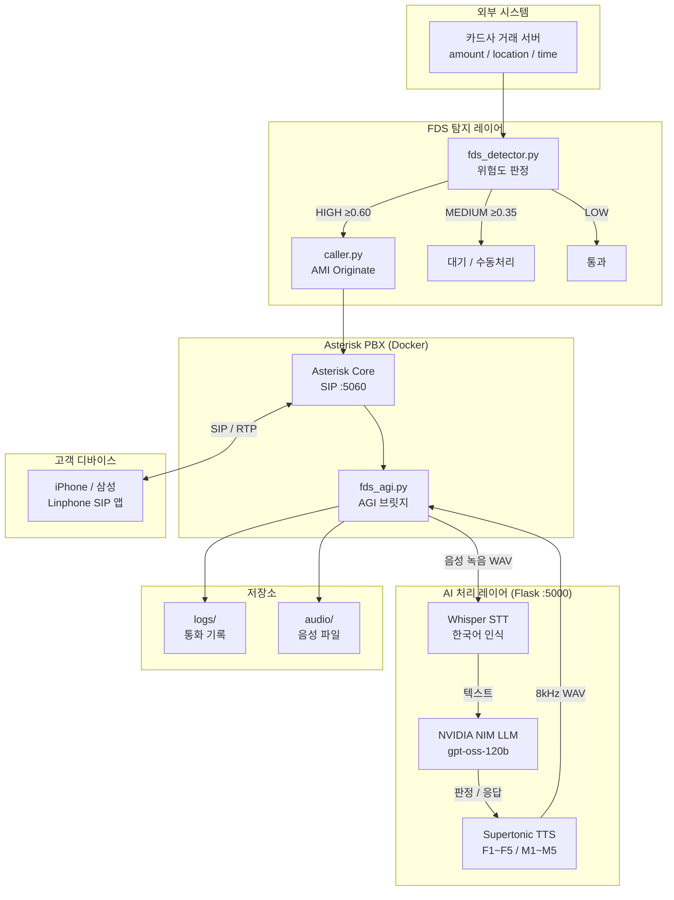

---

## 2. 상담 통화 흐름 (Sequence)

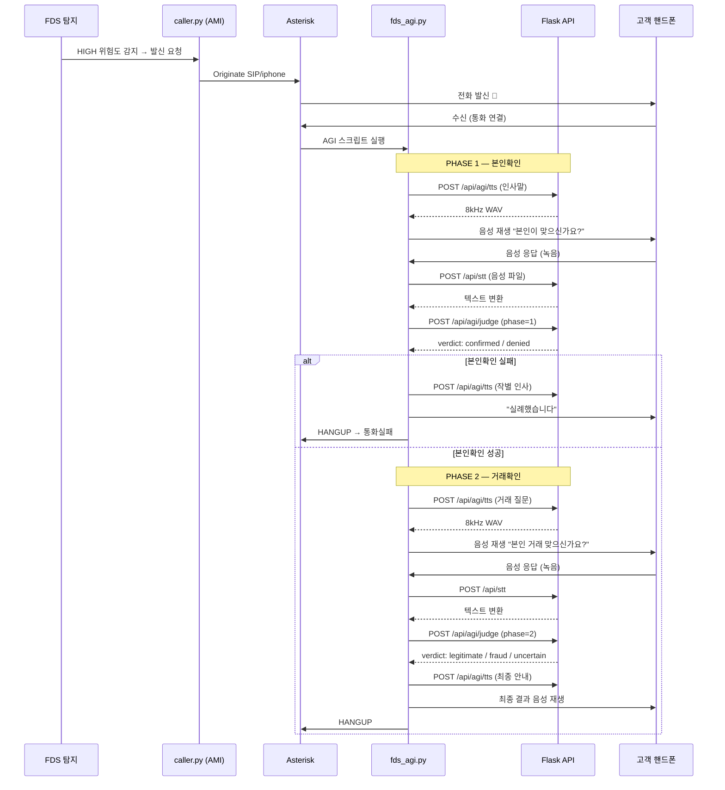

---

## 3. FDS 위험도 판정 흐름

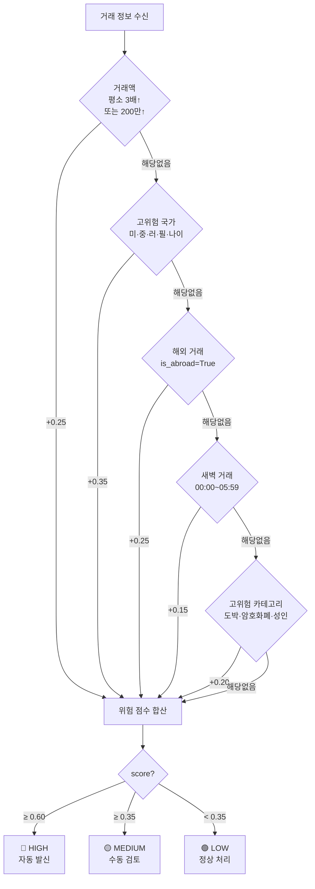

---

## 4. 파일 구조 및 역할

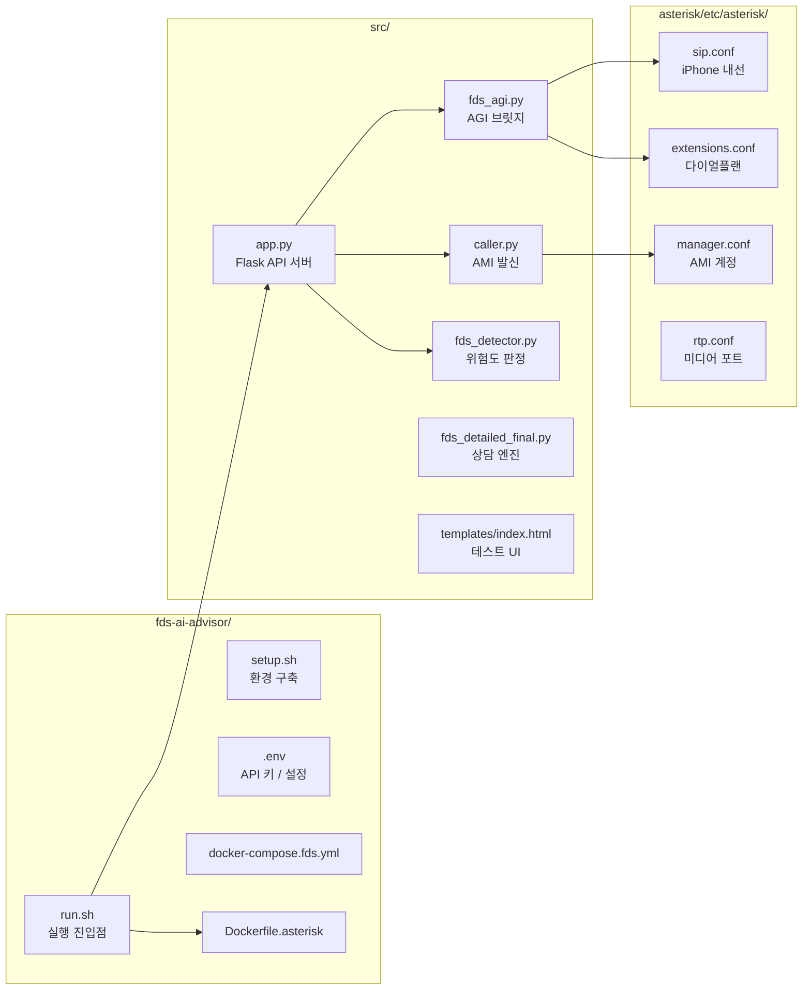

---

## 5. Docker 컨테이너 구성

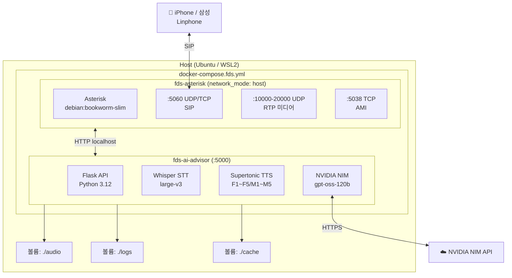

---

## 6. STT → LLM → TTS 데이터 흐름

```mermaid
flowchart LR
    MIC[🎙 고객 음성\nRTP 스트림]
    -->|Asterisk\nRECORD FILE| WAV_IN[WAV 파일\n8kHz mono]
    -->|POST /api/stt| WHISPER[Whisper\nlarge-v3]
    -->|한국어 텍스트| SANITIZE[입력 정제\n인젝션 방지]
    -->|POST /api/agi/judge| LLM[NIM LLM\ntemp=0]
    -->|verdict| JUDGE{판정}

    JUDGE -->|confirmed\nlegitimate| REPLY_GEN[응답 생성\ntemp=0.7]
    JUDGE -->|denied\nfraud| REPLY_GEN

    REPLY_GEN -->|POST /api/agi/tts| TTS[Supertonic\n44100→8kHz]
    -->|WAV 파일| PLAY[Asterisk\nSTREAM FILE]
    -->|🔊 고객 수신| SPEAKER[📱 고객 스피커]
```

---

## 7. TTS 엔진 비교 (독립 프로젝트 검토)

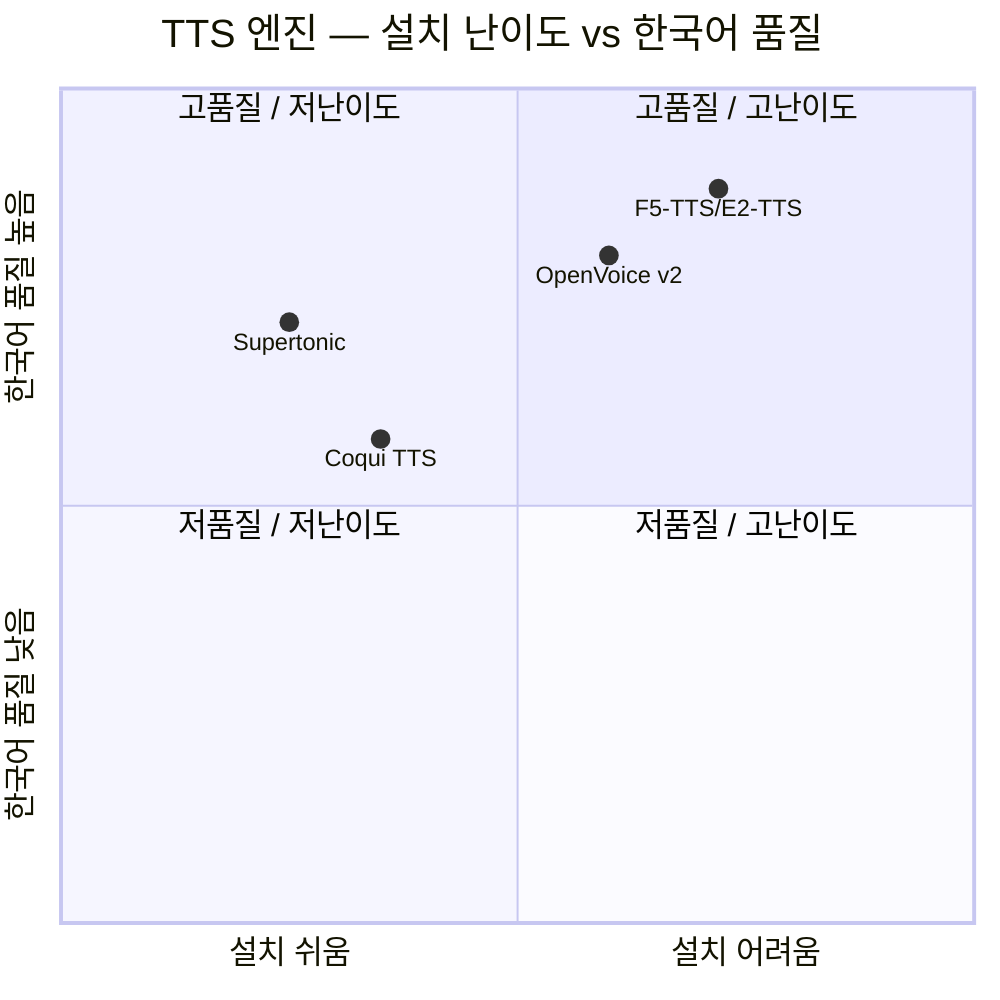

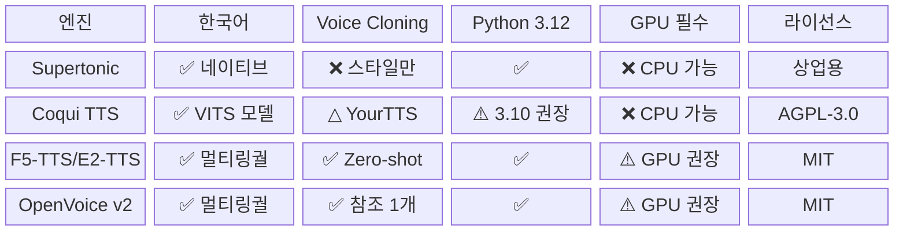

---

## 8. 독립 프로젝트 구조 (4개 분리안)

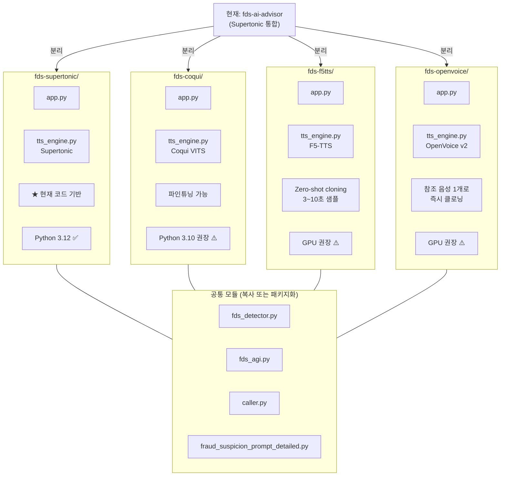

---

## 9. Linphone SIP 연결 흐름

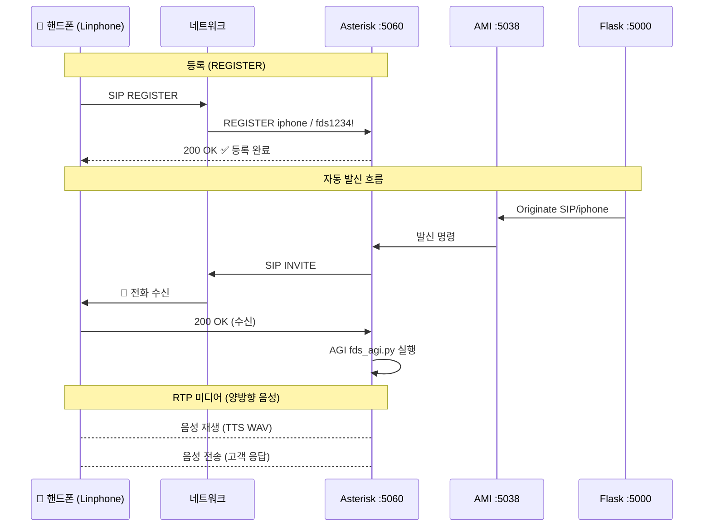

---

## 10. 배포 환경별 구성

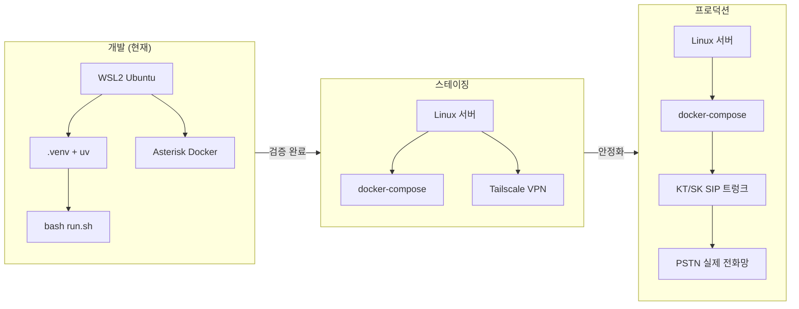
